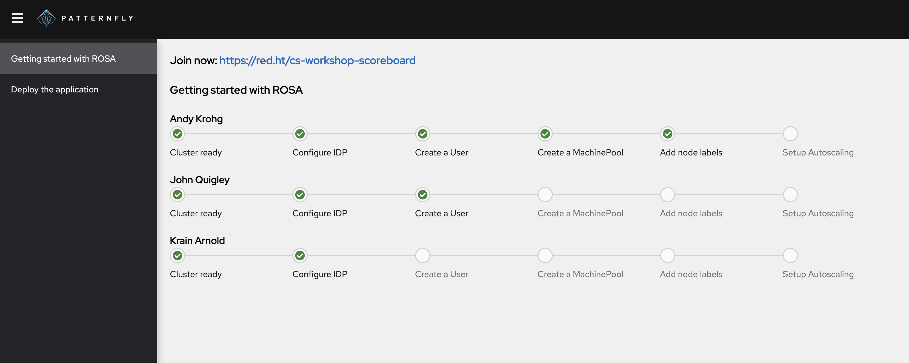

# ROSA Workshop Scoreboard - Server
This repository houses the server-side components for the **ROSA workshop scoreboard**, which displays live updates of user progress in the [ROSA workshop](https://rosaworkshop.io). This is intended to serve not only as an accountability measure to ensure everyone's engaged, but also as a *gamification element* to keep the workshop fun and competitive.

> If you're looking for the scoreboard server for the **ARO Workshop**, go [here](https://github.com/andykrohg/cs-workshop-scoreboard-server/tree/aro#aro-workshop-scoreboard---server) instead.

It is composed of a quarkus resteasy backend in `src/main/java` and a patternfly/reactjs frontend in `src/main/webapp`. It looks like this:



Once the server is deployed, your workshop participants will need to deploy a **telemetry agent** to their clusters to continually report their status. They'll need:
* The URL of your Scoreboard Server, and
* Instructions for deploying the agent, which can be found here: https://red.ht/rosa-workshop-scoreboard-client

## Running on OpenShift
Run the commands below to deploy your scoreboard server to OpenShift. Once it's running, present the scoreboard on the screen to track progress as participants get their agents deployed.
```bash
oc new-app quay.io/akrohg/cs-workshop-scoreboard-server:rosa
oc expose svc/cs-workshop-scoreboard-server

# Get the route to the server
oc get route cs-workshop-scoreboard-server
```

## Want to use this scoreboard for a different workshop?
Check out the development guide [here](DEVELOPMENT.md).
